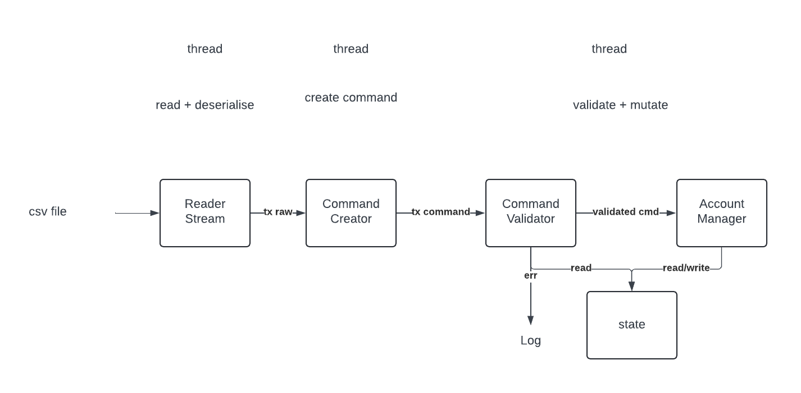

## Toy Payment Engine

## Design

I wanted to make something multithreaded and streaming so that it can handle alot more data, i ended up with something simple so that each thread had a job and that any jobs handling state would be contained in a single thread (again for simplicity).

Due to the sequential nature of the the csv file i wanted to keep state reading/writing in a single thread as multithreaded solutions would have taken too much time. 

(For example some operations like Deposit dont require any reading of state for validation, hence could be pushed straight away onto the account manager).

## Assumptions
Initially the language is ambiguous when defining the commands in the spec file. 
take: 
```
The transaction shouldn't be reversed yet but the associated funds should be held. This means
that the clients' available funds should decrease by the amount disputed, their held funds should
increase by the amount disputed, while their total funds should remain the same
```

The "available funds should decrease" implies that the tx will be a deposit.

The same applies to the other types of txs where these sort of implications are used.


